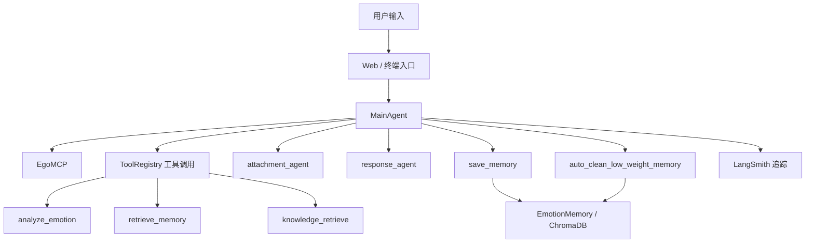

# RelationMind Agent

RelationMind Agent 是一个基于情感陪伴与依恋理论的智能对话代理，集成情绪分析、依恋风格评估、记忆检索和心理知识检索，打造面向用户关系成长的多角色陪伴体验。

## 主要特点

- ✅ 多角色陪伴：支持“温柔母亲”“沉稳父亲”“知心闺蜜”“理性挚友”“心理疏导师”等情感角色
- ✅ 情绪智能：内置情绪分析与安全检测，支持情绪识别与风险提示
- ✅ 依恋风格分析：基于用户对话动态评估依恋关系风格
- ✅ 关系记忆：使用向量记忆保存对话内容，支持记忆检索、权重强化和自动清理
- ✅ 专业知识检索：对负面情绪场景自动检索心理学疏导知识
- ✅ Web 界面：基于 Streamlit 构建的交互式情感陪伴界面
- ✅ 终端入口：提供 `main.py` 终端版对话体验

## 项目结构

- `main.py` - 终端入口，默认使用 `default_terminal_user`
- `web.py` - Streamlit Web UI 入口，支持用户登录与会话持久化
- `ego_mcp.py` - MCP 心智决策层，用于情绪与安全判断
- `memory_system.py` - 关系成长与记忆检索逻辑
- `agent/` - 多角色 Agent 组件
  - `main_agent.py` - 主 Agent 调度入口
  - `emotion_agent.py` - 情绪分析 Agent
  - `attachment_agent.py` - 依恋风格 Agent
  - `response_agent.py` - 回复生成 Agent
  - `attach_agent.py` - 依恋行为辅助 Agent
- `memory/` - 向量记忆实现
- `tools/` - 工具注册与心理知识检索工具
- `config/` - 配置与 LangSmith 追踪设置
- `schema/` - 消息与数据结构定义
- `utils/` - 日志与重试等通用工具

## 安装与依赖

推荐使用虚拟环境：

```bash
python -m venv .venv
.\.venv\Scripts\activate
```

安装依赖：

```bash
pip install -r requirements.txt
```

## 配置

项目使用 `.env` 环境变量配置：

```env
DASHSCOPE_API_KEY=your_dashscope_api_key
LANGCHAIN_API_KEY=your_langchain_api_key
```

默认模型配置位于 `config/settings.py`：

- `MODEL_NAME`：默认 `qwen-turbo`
- `TEMPERATURE`：默认 `0.7`
- `CHROMA_DIR`：向量数据库目录

## 运行方式

### 1. 终端对话

```bash
python main.py
```

输入对话内容后，程序会输出：

- 情绪分析结果
- 依恋风格
- 检索到的记忆
- 执行链路与耗时
- 最终回复

### 2. Streamlit Web UI

```bash
streamlit run web.py
```

Web 界面支持：

- 用户登录与多会话管理
- 情感数据面板
- 关系等级与记忆统计
- 多角色对话选择

## 系统架构图

下面展示 RelationMind Agent 的核心方案架构：



### 核心模块说明

- `web.py`：Streamlit 前端界面，支持登录、会话持久化与角色切换
- `main.py`：终端入口，适合快速调试和测试
- `MainAgent`：主控层，负责工具决策、情绪评估、记忆检索与回复生成
- `EgoMCP`：情绪与安全检测层，判断是否触发风险提示
- `memory_system.py`：关系记忆检索、权重更新、自动清理与关系等级计算
- `config/langsmith.py`：LangSmith 全链路追踪配置

## 运行示例

### 终端模式示例

```bash
python main.py
```

示例交互：

```text
你：最近压力很大，真的好想休息。

【情绪】焦虑
【依恋】安全型
【记忆】['上次你说过你想找一份更稳定的工作。']
【执行链路】analyze_emotion → retrieve_memory → knowledge_retrieve
【总耗时】1.42s
【回复】听起来你最近很累，我在这里陪你，一起想想怎样给自己更多缓冲和安全感。
```

### Web UI 模式示例

```bash
streamlit run web.py
```

Web 界面支持：

- 用户登录，生成 `user_id`
- 会话历史自动保存到 `chat_history/`
- 情感面板展示当前情绪、关系等级与记忆数量
- 角色选择动态切换对话风格

## 部署说明

### 本地部署

1. 创建并激活虚拟环境：

```bash
python -m venv .venv
.\.venv\Scripts\activate
```

2. 安装依赖：

```bash
pip install -r requirements.txt
```

3. 配置环境变量：

在项目根目录创建 `.env`：

```env
DASHSCOPE_API_KEY=your_dashscope_api_key
```

4. 运行 Web 应用：

```bash
streamlit run web.py
```

5. 运行终端测试：

```bash
python main.py
```

### 生产环境建议

- 建议使用容器化部署，并将 `DASHSCOPE_API_KEY` 等敏感信息注入环境变量
- 确保 `config/langsmith.py` 中的 LangSmith API Key 已替换为你自己的密钥
- 将 `chat_history/` 与 `config/settings.py` 中的 `CHROMA_DIR` 目录纳入持久化存储
- 通过反向代理（如 Nginx）或 Streamlit Cloud 提供安全访问
- 监控日志与记忆数据库文件大小，定期清理低权重记忆

## 备注

- `main.py` 面向终端测试入口，`web.py` 是推荐的用户交互入口
- 项目依赖 `langchain`, `langchain_community`, `streamlit`, `chromadb` 等
- `config/langsmith.py` 默认启用 LangSmith 追踪，建议替换为你自己的 `LANGCHAIN_API_KEY`
